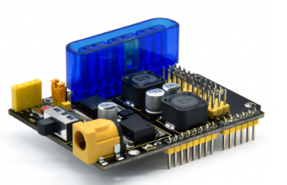
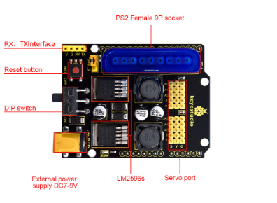

# KS0550 Keyestudio Servo Driver Expansion Board(Black and Eco-friendly)




## 1. Description

This is an Arduino servo driver shield. It has a PS2 interface for using a PS2 handle control. It contains 10 IO interfaces used to connect servos or other sensors. in addition, we have also extended RX/TX interfaces to interface with serial communication modules like BT modules. There are two LM2596 voltage regulator ICs onboard, which can provide a stable 600mA current for each servo. It is also applied to mechanical structures such as robotic arms.

## 2. Specification

- Input voltage VIN: DC 7-9V
- Input current VIN: maximum 5A
- Output voltage: 5V
- Output current: max 3A
- Voltage regulator IC: LM2596S
- Frequency: 150kHz
- PS2 interface: PS2 female 9P socket
- Working temperature: 0~50
- Size: 73*53.34mm

## 3. Pin-out



## 4. Wiring Diagram


Test Code

**Library files and code download：**[Resources](./Resources.7z)

```c
#include <Servo.h>
Servo myservo1;  
Servo myservo2;
Servo myservo3;
Servo myservo4;
int pos1 =0;

void setup()
{
  myservo1.attach(A1);  
  myservo2.attach(A0);
  myservo3.attach(8);
  myservo4.attach(9);
  
  myservo1.write(0);
  myservo2.write(0);
  myservo3.write(0);
  myservo4.write(0);
  delay(1000);
}

void loop() 
{
    for (pos1 = 0; pos1 <= 180; pos1 += 1) { // from 0 to 180
     myservo1.write(pos1);                // servo 1 rotates to pos1
     myservo2.write(pos1);                // servo 2 rotates to pos1
     myservo3.write(pos1);                // servo 3 rotates to pos1
     myservo4.write(pos1);           // servo 4 rotates to pos1
    delay(10);                          //control the speed of servos
  }
  for (pos1 = 180; pos1 >= 0; pos1 -= 1) { //from 180 to 0
     myservo1.write(pos1);           // servo 1 rotates to pos1
     myservo2.write(pos1);           // servo 2 rotates to pos1
     myservo3.write(pos1);           // servo 3 rotates to pos1
     myservo4.write(pos1);           // servo 4 rotates to pos1
    delay(10);
  }
}
```

## 5. Test Result

Stack the driver board onto the control board, wire up and upload the code. Four servos rotate from 0° to 180°, then from 180° to 0°.